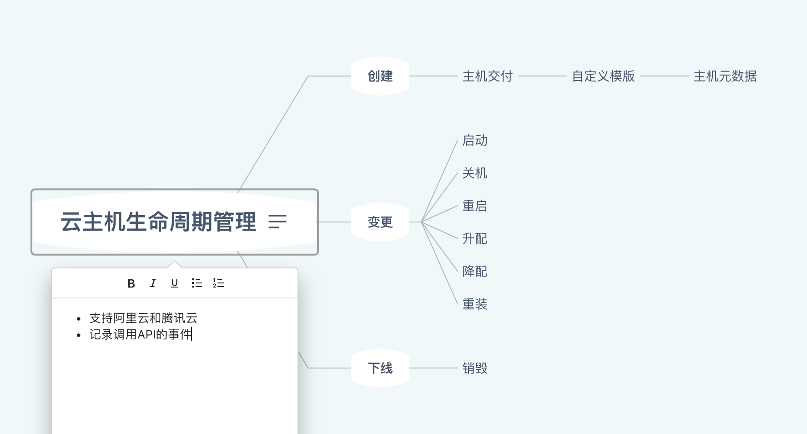
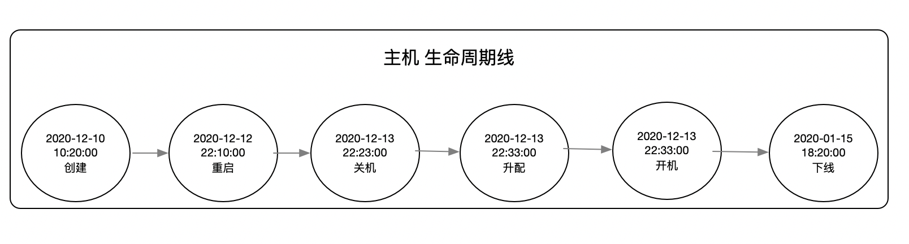

# lightning-go 

## 环境依赖

### 版本依赖

- Go 1.14+
- MySQL 5.7+
- Redis 3.2+


## 模块介绍
- [x] 多云云主机生命周期管理
    - [x] 阿里云 
    - [x] 腾讯云 
    - [ ] 华为云 
    - [ ] 亚马逊 
- [ ] 消息中心 
- [X] 任务调度
    - [X] 触发Dag任务
    - [X] 查询Dag详情
    - [ ] 查看任务日志
- [ ] 定时任务






## 项目目录结构

```bash
├── README.md
├── build.sh
├── cmd              # 项目入口
│   ├── migrate      # 创建表
│   └── server       # 启动服务
├── config           # 配置文件
│   ├── config.toml  # 配置文件
├── go-ops.service   # 服务systemd文件
├── go.mod
├── go.sum
├── internal         # 内部依赖
│   ├── app          # 应用
│   ├── cron         # 定时任务
│   ├── db           # 数据库
│   └── http         # http
├── logs             # 日志目录
├── pkg
├── scripts
└── test             # 测试用例
```

## 部署

- 克隆代码
```bash
$ git clone git@github.com:zhengyansheng/lightning-go.git 
```

```bash
$ cd lightning-go
$ go mod init lightning-go 

```

- 同步数据库
```bash
# make migrate
```

- 启动服务
```bash
# make run
```

- 生成 api docs
```bash
# make swagger
```

## 定时任务

- 同步云主机元数据
    - 同步新增
    - 变更
    - 通知异常

```bash
$ go run scripts/cron/cron_sync_instance.go
```